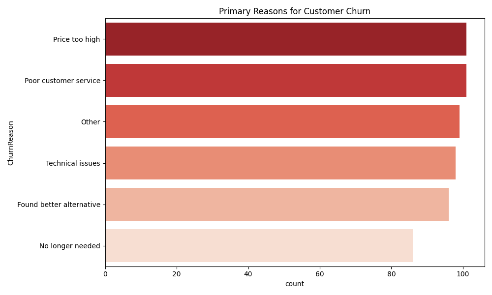
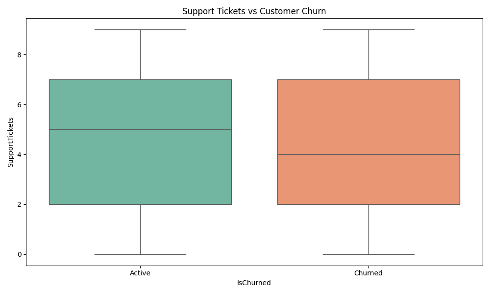
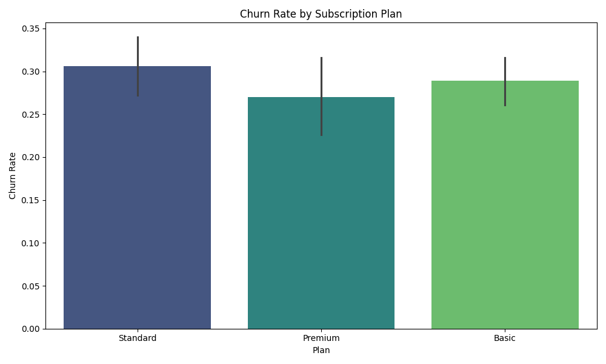
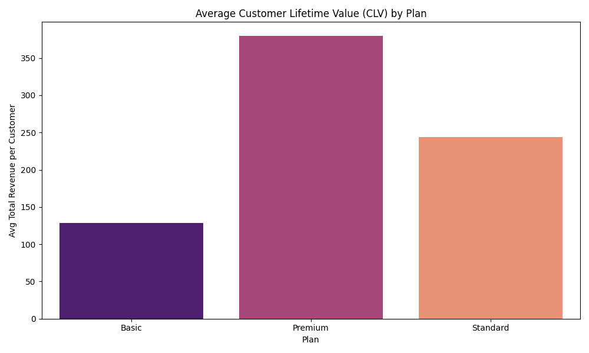

# Customer Retention & Churn Analysis Report

## Executive Summary
This report analyzes customer churn patterns and retention drivers for a subscription-based business. The goal is to identify why customers leave and provide data-driven recommendations to improve customer lifetime value (CLV).

### Key Performance Indicators (KPIs)
- **Overall Churn Rate:** 29.05%
- **Total Customers Analyzed:** 2,000
- **Average Customer Tenure:** 12.6 months
- **Average Customer Lifetime Value (CLV):** $212.95
- **Primary Churn Reason:** Price too high

---

## 1. Churn Reasons Analysis
Understanding why customers leave is critical for developing retention strategies.

*Insight:* **Price too high** and **Technical issues** are the leading causes of churn. This suggests a need for better pricing tiers or improved service stability.

## 2. Retention Drivers
We analyzed the correlation between customer support engagement and churn.

*Insight:* Churned customers tend to have a slightly higher number of **Support Tickets**, indicating that unresolved technical or billing issues directly lead to customer loss.

## 3. Churn by Subscription Plan
Performance comparison across different plan tiers.

*Insight:* Churn rates vary by plan. The **Premium** plan shows a different churn profile compared to **Basic**, suggesting that value perception differs across tiers.

## 4. Customer Lifetime Value (CLV)
Revenue contribution by different customer segments.

*Insight:* While Premium plans have higher monthly charges, their long-term value depends heavily on their retention rate.

---

## Actionable Recommendations

1. **Implement a Loyalty Program:** Offer discounts or exclusive features to customers approaching the 12-month mark (the average tenure) to encourage long-term commitment.
2. **Improve Proactive Support:** Identify customers with more than 3 support tickets in a month and reach out with a proactive resolution or a small "goodwill" credit to prevent churn.
3. **Review Pricing Tiers:** Since "Price too high" is the top churn reason, consider introducing a "Lite" plan or providing more value-added features to existing tiers to justify the cost.
4. **Technical Stability:** Address the root causes of support tickets to reduce friction during the customer journey.
5. **Win-back Campaigns:** Target customers who churned due to "Price" with a limited-time discount to re-subscribe.

---
*Report generated on: 2026-04-25*
